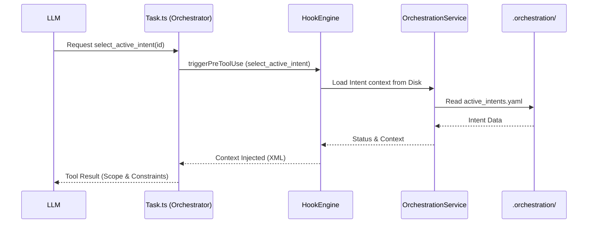
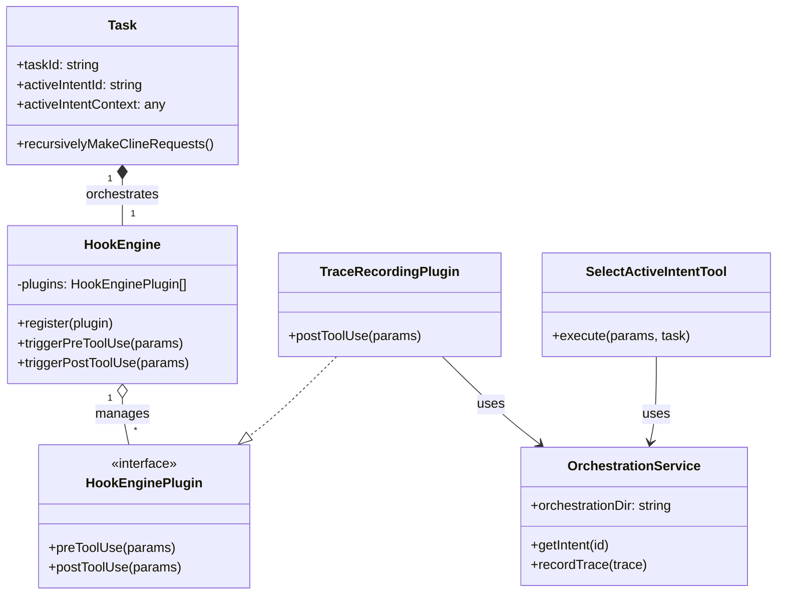
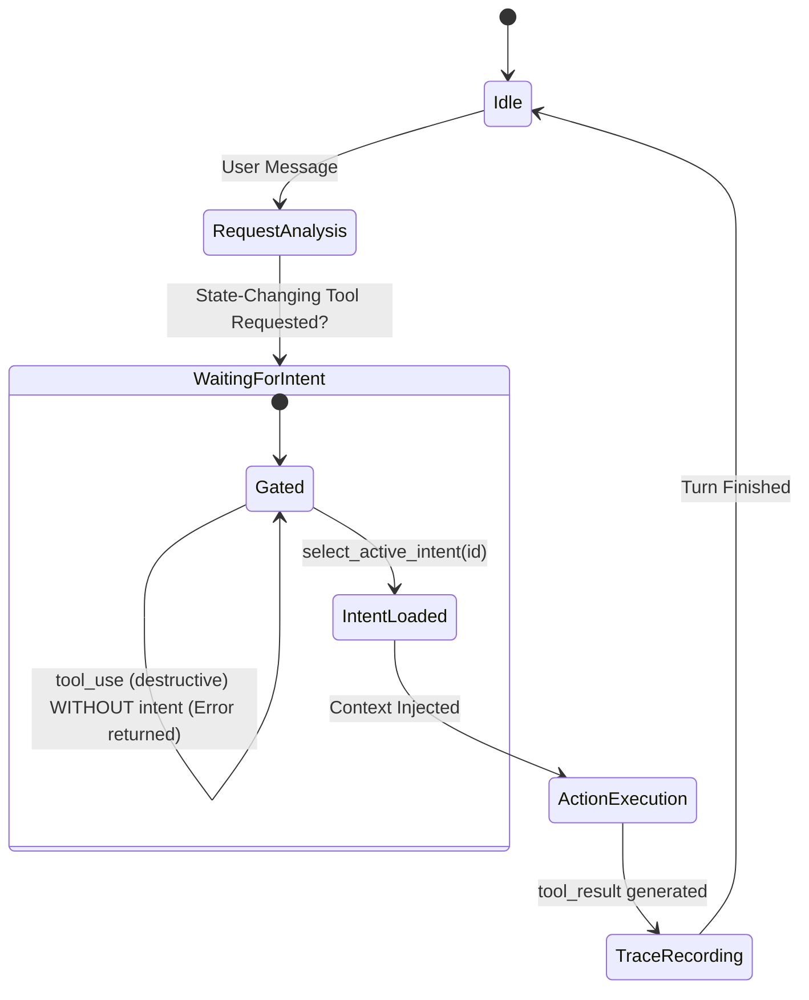

## 1. How the VS Code Extension Works (The Tool Loop)

The core functionality of the Roo Code extension revolves around a methodology where the LLM is given access to a "terminal" and "filesystem" through VS Code APIs.

### Tool Execution Loop

Roo Code implements an agentic loop in `src/core/task/Task.ts`:

The tool execution loop in Roo Code is a sophisticated agentic loop that coordinates LLM responses with local tool execution.

**Key Orchestrator: `src/core/task/Task.ts`**

- `initiateTaskLoop(userContent)`: The main entry point for a task. It initializes checkpoints and starts the sequential request loop.
- `recursivelyMakeClineRequests(...)`: The core of the loop. It:
    1. Prepares environment details (cwd, file structure, etc.).
    2. Adds the user message to history.
    3. Calls `api.createMessage` (via `attemptApiRequest`) to get a streaming response from the LLM.
    4. Iterates through the streamed chunks (text, tool calls).
    5. Dispatches content to `presentAssistantMessage` during streaming.

**Tool Dispatcher: `src/core/assistant-message/presentAssistantMessage.ts`**

- `presentAssistantMessage(cline: Task)`: This function handles the "presentation" and execution of content blocks.
- It contains a comprehensive `switch (block.name)` statement for tools.
- **`execute_command`**: Handled by `executeCommandTool.handle(cline, block, ...)` (Line 765).
- **`write_to_file`**: Handled by `writeToFileTool.handle(cline, block, ...)` (Line 681).

**Specific Tool Implementations: `src/core/tools/`**

- Each tool inherits from `BaseTool` and implements an `execute` (for full blocks) and sometimes `handlePartial` (for streaming) method.
- `ExecuteCommandTool.ts`: Manages terminal interaction, output streaming, and termination.
- **WriteToFileTool.ts**: Handles file creation/modification, including integration with the Diff View and SHA-256 hashing for the trace layer.

## 2. Prompt Construction (The System Prompt)

Roo Code uses a dynamic, modular system for constructing the system prompt.

**Core Builder: `src/core/prompts/system.ts`**

- `SYSTEM_PROMPT(...)`: The primary function called to generate the operational context for the LLM.
- It uses a "build/generate" pattern, calling `generatePrompt` which aggregates multiple sections.

**Modular Sections: `src/core/prompts/sections/`**

- The prompt is built from various segments:
    - `role`: Defines the persona (e.g., "You are Roo...").
    - `capabilities`: Details what the agent can do.
    - `modes`: Instructions specific to the current active mode (Code, Architect, etc.).
    - `tools`: Documentation for the available tools.
    - `rules`: Global and project-specific constraints.
- This modularity allows Roo Code to be highly customizable via `customModes` and `customInstructions`.

### 3. UI and State Management

**Provider: `src/core/webview/ClineProvider.ts`**

- Acts as the `WebviewViewProvider`.
- Manages the lifecycle of the webview and serves as the bridge between the UI (React) and the core `Task` logic.
- Handles `postMessage` communication for task updates, terminal output, and user interactions.

---

## Technical Context for Development

### Extension Host Activation

- Entry point: `src/extension.ts`.
- VS Code `activate` function initializes services (Telemetry, MCP, etc.) and registers the `ClineProvider`.

### Debugging & Testing

- Use the **"Run and Debug"** sidebar in VS Code.
- Launch the **"Roo Code"** configuration to start a new Extension Development Host.
- This allows for real-time testing of changes to the core logic or UI.

---

## Environment & Setup Notes

- **Node.js**: Expected `v20.x` (enforced via `.pnpm-workspace.yaml` and `.npmrc`).
- **Package Manager**: `pnpm` (configured as a monorepo with `turbo`).
- **Build System**: Managed by `turbo`. Key commands: `pnpm run build`, `pnpm run dev`.
    - `capabilities.ts`: Description of what the agent can do.
    - `tool-use.ts`: Instructions on how to use tools.
    - `objective.ts`: Defines the agent's goal-oriented behavior.

## 4. Integration Point: Webview Provider

`src/core/webview/ClineProvider.ts` acts as the bridge between the VS Code UI (Webview) and the `Task` logic. It handles sidebar registration, message passing, and state management.

## 5. Architectural Decisions & Implementation of the Hook System

The Hook System has been fully implemented to meet the requirements of the Deterministic Hook System, providing robust context management and governance.

### A. Lifecycle Interceptors

- **Pre-Hook (Enforcement)**: Injected into `presentAssistantMessage.ts` before tool execution. This intercepts state-changing tool calls (like `write_to_file` or `execute_command`) and validates them against the active intent context.
- **Post-Hook (Traceability)**: Injected into the `pushToolResult` path. This triggers the `TraceRecordingPlugin` to log the `agent_trace.jsonl` entry.

### B. Two-Stage State Machine (Handshake)

- **The `select_active_intent` Tool**: Implemented and registered as a native tool. This is the mandatory "Handshake" tool that enables the agent to declare its intent before acting.
- **Context Injection**: When an intent is selected, the `HookEngine` loads the specific scope and constraints from `.orchestration/active_intents.yaml` and injects them back into the agent's context.
- **Intent Gating**: Destructive tools are strictly gated. If no intent is selected, or if the action violates the intent's scope, the execution is blocked with a "Structure Validation Error" or "Scope Violation".

### C. Data Model (.orchestration/)

- **`OrchestrationService`**: A centralized service that manages the `.orchestration/` directory, handling YAML for intent specifications and JSONL for the trace ledger.
- **Persistence**: All intent states and agent traces are persisted in the workspace, ensuring the "Shared Brain" survives across sessions.

### D. Spatial Independence & Governance

- **SHA-256 Hashing**: Implemented using the Node.js `crypto` module. Every `write_to_file` and `apply_diff` operation labels the trace with a content hash.
- **Scope Enforcement**: Uses the `ignore` library to perform high-performance glob matching against the intent's `owned_scope`.

## 6. Diagram of the Hook System

### A. Two-Stage Handshake Execution Sequence

The sequence of the intent-driven enforcement.



### B. Hook System Class Diagram

The static structure of the hook infrastructure and its relationship with core Roo Code components.



### C. The Two-Stage State Machine (Handshake)

Enforcement of the plan-first strategy before any destructive actions.



---

## 7. Data Schemas (.orchestration/)

To ensure interoperability and governance, the following schemas are enforced by the `OrchestrationService`.

### A. active_intents.yaml

Formal specification of business requirements and their spatial ownership.

```yaml
active_intents:
    - id: "string" # INT-001
      name: "string" # Human readable title
      status: "string" # IN_PROGRESS | COMPLETED
      owned_scope: # Spatial boundaries
          - "src/auth/**"
      constraints: # Behavioral boundaries
          - "No external APIs"
      acceptance_criteria: # Definition of Done
          - "Unit tests pass"
```

### B. agent_trace.jsonl (The AI-Native Ledger)

Append-only log for traceability, using content hashing for spatial independence.

```json
{
	"id": "uuid-v4",
	"timestamp": "ISO-8601",
	"vcs": { "revision_id": "git_sha_hash" },
	"intentId": "string",
	"toolName": "string",
	"params": { "path": "string", "content": "..." },
	"files": [
		{
			"relative_path": "string",
			"content_hash": "sha256:...",
			"conversations": [
				{
					"contributor": { "entity_type": "AI", "model_identifier": "..." },
					"related": [{ "type": "specification", "value": "REQ-001" }]
				}
			]
		}
	]
}
```

## 8. Future Roadmap: The Neural Graft (Phase 2)

In the next phase, we will transition from basic intent traceability to **Neural Grafting**, where specialized specification frameworks are deeply integrated into the IDE context.

### Spec-Driven Development (SDD) Integration

We will integrate the **GitHub Spec Kit** (or equivalent Spec Frameworks) to:

- **Semantic Hooks**: Map active intents to specific markdown specifications (`docs/*.md`, `specs/*.md`).
- **Living Constitutions**: Enforce project-level principles during the code generation phase.
- **Spec-Code Sync**: Ensure that every `write_to_file` operation is validated against the corresponding spec file.

### Advanced Knowledge Mesh

- **Vectorized Context**: Create an in-memory index of project specs.
- **Collaborative Filtering**: Surface relevant spec sections based on the code being edited.

---
