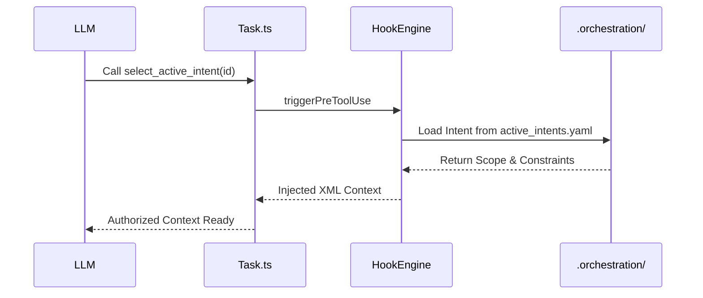
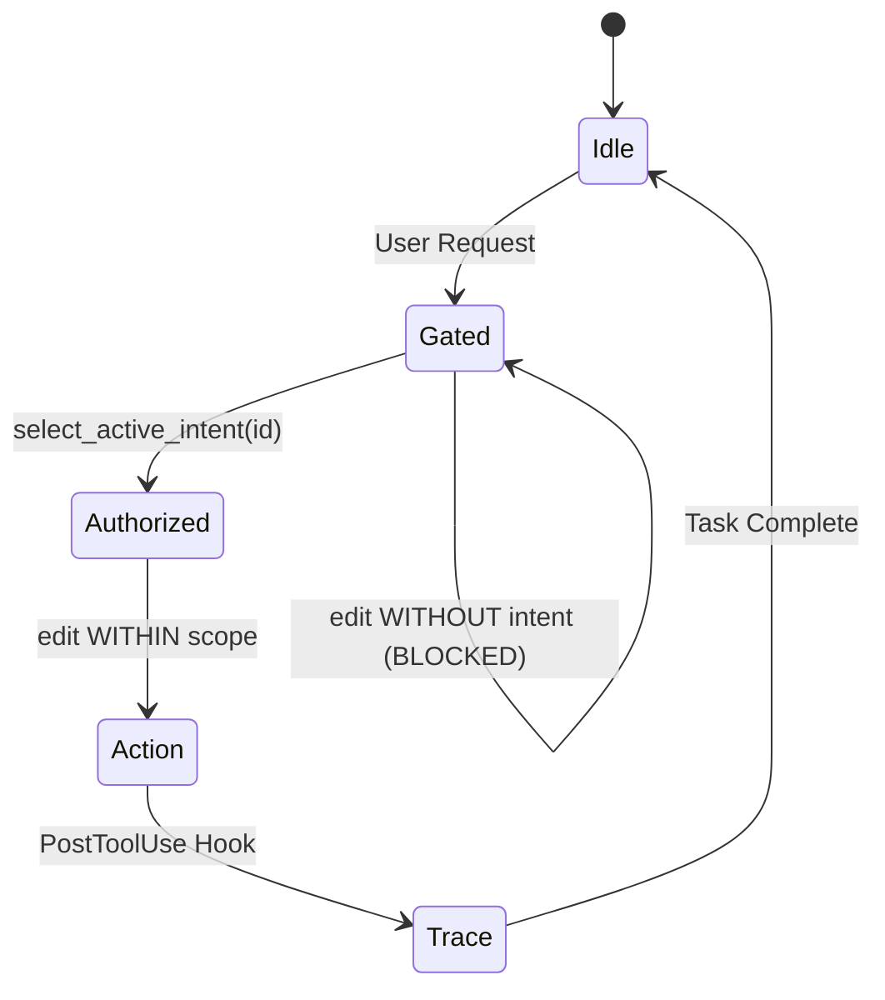

# TRP1 Interim Report: Architecting the AI-Native IDE & Intent-Code Traceability

## 1. Introduction: The Business Objective

Software engineering is undergoing a tectonic shift from manual syntax creation to the **orchestration of silicon workers**. As AI-generated code proliferates, the primary bottlenecks shift from productivity to **Governance** and **Context Management**.

### 1.1 The Master Thinker Philosophy

This project adopts the "Master Thinker" philosophy, moving away from "Vibe Coding" where developers blindly accept AI output. Instead, we architect an environment where the IDE acts as a rigorous manager. We enforce a **Plan-First** strategy and a "Shared Brain" to prevent technical drift.

### 1.2 Repaying Cognitive and Trust Debt

Modern development faces two new forms of debt:

1.  **Cognitive Debt**: Knowledge decay that occurs when humans skim AI output rather than deeply understanding the architecture.
2.  **Trust Debt**: The gap between superhuman machine output and human-verifiable correctness.

Our architecture serves as the repayment mechanism by replacing blind trust with **cryptographic verification** and **Deterministic Hook Systems**.

---

## 2. System Architecture & The Nervous System

The project forks **Roo Code**, an agentic VS Code extension, to inject a governed orchestration layer.

### 2.1 The Tool Execution Loop (The Heart of the Agent)

The extension host manages an asynchronous loop that coordinates LLM responses with local tool execution.

- **Orchestrator (`src/core/task/Task.ts`)**:
    - `initiateTaskLoop`: Initializes the session, sets up the workspace, and prepares the `OrchestrationService`.
    - `recursivelyMakeClineRequests`: The main loop that manages conversation history, token usage, and API interactions. It acts as the "Manager" of the turn-based conversation.
- **Dispatcher (`src/core/assistant-message/presentAssistantMessage.ts`)**:
    - This is the execution router. When the LLM emits a tool call (e.g., `write_to_file`), this dispatcher validates and executes the command.
    - We have instrumented this file with **Governance Hooks** to monitor and block unauthorized actions.

### 2.2 Modular Prompt Engineering

Roo Code’s system prompt is not a static string but a dynamically assembled document generated by `src/core/prompts/system.ts`.

- **Context Curation**: The system selects modules (Capabilities, Roles, Tools, Rules) based on the active mode (e.g., `Code` vs `Architect`).
- **Real-Time Environment Injection**: The prompt builder scans the current directory and open files to curate the "Context Window," preventing "Context Rot."

---

## 3. The Hook System & Middleware Boundary

We have implemented a **Deterministic Hook System** that intercepts every tool execution request to enforce formal architectural boundaries.

### 3.1 The Hook Engine Infrastructure

Located in `src/hooks/HookEngine.ts`, the engine acts as an isolated middleware layer between the Agent and the Tool Handlers.

- **Plugin Architecture**: It supports the registration of `HookEnginePlugin` members.
- **Lifecycle Interceptors**:
    - **`triggerPreToolUse`**: Pauses the execution loop to validate intent and scope.
    - **`triggerPostToolUse`**: Records the result, updates the trace ledger, and evolves documentation.

### 3.2 The Two-Stage Handshake (Reasoning Intercept)

We solve the "Context Paradox" (acting before understanding) via a mandatory **Two-Stage State Machine**:

1.  **The Request**: User asks for a modification.
2.  **The Handshake**: The Agent MUST call `select_active_intent(intent_id)`.
    - The `HookEngine` intercepts this call.
    - It loads constraints from `.orchestration/active_intents.yaml`.
    - It injects this "Deep Context" back into the LLM as a tool result.
3.  **Contextualized Action**: The Agent, now possessing authorized scope and constraints, performs the work.

### 3.3 Governance via Scope Enforcement

In the `presentAssistantMessage.ts` dispatcher, we enforce **Scope Boundaries**:

- **Mechanism**: Use the `ignore` library to perform high-performance glob matching against the `owned_scope` defined in the active intent.
- **Blocking**: If an agent attempts to write to a file outside its authorized scope (e.g., editing `README.md` when the intent is restricted to `src/auth/**`), the Hook Engine **blocks execution** and returns a rejection error.

---

## 4. The AI-Native Git Layer (Full Traceability)

Traditional Git tracks _what_ changed. Our layer tracks _why_ and _who (AI Model)_.

### 4.1 Trace Recording (`src/hooks/TraceRecordingPlugin.ts`)

We have implemented a semantic tracking ledger that links abstract Intent IDs to concrete Code Hashes.

- **SHA-256 Spatial Hashing**: Every modification to the filesystem is hashed using the Node.js `crypto` module.
- **Spatial Independence**: By storing the content hash rather than line numbers, the trace remains valid even if the code moves within the file.

### 4.2 The Trace Ledger: `agent_trace.jsonl`

An append-only, machine-readable history of every mutating action.

- **Schema**:
    - `id`: UUID-v7 for unique event identification.
    - `intentId`: Cross-reference to `active_intents.yaml`.
    - `modelIdentifier`: The specific LLM that generated the code.
    - `contentHash`: The cryptographic proof of the code state.

---

## 5. The Data Model (.orchestration/)

The `.orchestration` directory houses machine-managed sidecar files that serve as the "Shared Brain."

### 5.1 active_intents.yaml

Treats the codebase as a collection of formalized intents.

- **Structure**:
    - `id`: Unique requirement ID.
    - `owned_scope`: List of authorized file patterns.
    - `constraints`: Injected architectural rules.
    - `acceptance_criteria`: The "Definition of Done."

### 5.2 agent_trace.jsonl

The ledger of all agentic modifications, ensuring full traceability and non-repudiation.

### 5.3 [AGENT.md](http://AGENT.md) / CLAUDE.md

A persistent knowledge base containing "Lessons Learned" and project-specific stylistic rules, shared across parallel agent sessions.

---

## 6. Sequence Diagrams & State Machines

### 6.1 Handshake Sequence

### 6.2 Governance State Machine

---

## 7. Advanced Orchestration & Future Roadmap

### 7.1 Optimistic Locking & Concurrency Control

To support **Parallel Orchestration** (Phase 4), the architecture is prepared for optimistic locking:

- **Stale File Detection**: Before an agent writes to a file, the Hook Engine compares the current disk hash with the initial "read" hash.
- **Collision Prevention**: If a parallel agent or human has modified the file, the Hook Engine blocks the write, preventing "silent overwrites" and technical drift.

### 7.2 Context Curation vs. Context Rot

Following the **Martin Fowler** philosophy of Context Engineering:

- **Curation**: Rather than dumping the entire codebase, our Pre-Hook filters the context to only include AST nodes and intent history relevant to the current `intent_id`.
- **Decay Prevention**: By enforcing boundaries, we prevent "Context Rot" where the model's performance degrades due to irrelevant or conflicting information in the prompt.

### 7.3 The "Hive Mind" Strategy

The use of **CLAUDE.md** and the **Trace Ledger** allows multiple agent sessions to act as a single "Hive Mind." Every lesson learned by one agent (e.g., a fix for a recurring lint error) is immediately available to all others via the shared orchestration context.

---

## 8. Submission Artifacts Checklist

As of this interim submission, the following components are fully implemented and available in the provided GitHub repository:

- **Clean Hook Engine**: `src/hooks/HookEngine.ts`, `TraceRecordingPlugin.ts`.
- **Governed Dispatcher**: `src/core/assistant-message/presentAssistantMessage.ts`.
- **Orchestration Service**: `src/services/orchestration/OrchestrationService.ts`.
- **Tool Registration**: `src/core/tools/SelectActiveIntentTool.ts`.
- **Trace Documentation**: `.orchestration/agent_trace.jsonl`, `active_intents.yaml`.

---

_Prepared by Antigravity for the 10Academy Week 1 Challenge - Interim Submission._
